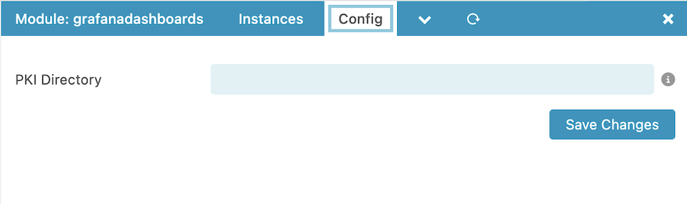
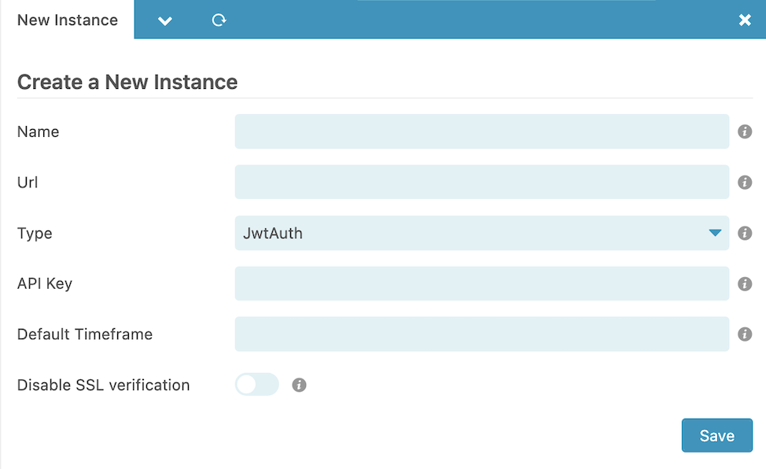

# Configuration 

## Module Configuration  

| Option        | Required | Description                                                                                             |
|---------------| -------- |---------------------------------------------------------------------------------------------------------|
| PKI Directory | **yes**  | Here you can override the pki directory which defaults to /etc/icingaweb2/modules/grafanadashboards/pki |

## Instance Configuration  

Here you can configure your grafana instances. The name you choose here will be used as a menu item in IcingaWeb2.
Create a service account in grafana first and the token her as api key.

| Option        | Required | Description                                                                                         |
|---------------|----------|-----------------------------------------------------------------------------------------------------|
| Name          | **yes**  | A Name of the grafana instance                                                                      |
| Url           | **yes**  | The Url of the instance, for example https://monitoring.local or https://monitoring.local/grafana') |
| Instance Type | **yes**  | This can be JWT, None, or GrafanaModule (if the grafana module is enabled)                          |
| API Key       | no       | The api key of a service user                                                                    |
| Default Timeframe   | no       | The default timeframe for the dashboards                                                                      |
| Disable SSL verification    | no       | Enable or disable SSL verification                                                                      |

